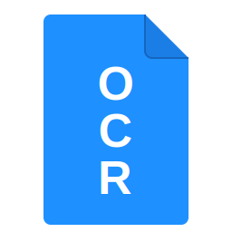

<p align="center">
  
</p>

# fwaocr - Free Windows Auto OCR

Free Windows Auto OCR is a free and open source OCR (Optical Character Recognition) tool for Windows.

It provides a no-setup one-click `.exe` file.

The tool will run in the background and will automatically detect new PDF files in the folders you specify.

The PDFs will be analyzed using the built-in Windows OCR engine, and the text layer will be added to the PDF.

Optionally, the original file can be moved to a backup folder.

Note: Since the Windows OCR API is used, this tool is only supported on **Windows 10+ / Windows 11**.

## Configuration

When started, the tool will appear as a small icon in the system tray. You can right-click on it to open the configuration window.

In the configuration window, you can set the following options:

- Folders to watch
- Backup folder (per watched folder) where to move the original file

### Autostart

If you want the tool to run in the background at boot, you can add a link to the `.exe` file to your windows startup folder in `shell:startup`.

## Build

Requires [.NET 8 SDK](https://dotnet.microsoft.com/download/dotnet/8.0).

```bash
# Debug build
dotnet build src/FreeWindowsAutoOCR.csproj

# Publish single-file .exe
dotnet publish src/FreeWindowsAutoOCR.csproj -c Release
```

The published `.exe` will be in `src/bin/Release/net8.0-windows10.0.19041.0/win-x64/publish/`.

## Tech Stack

- **C# / .NET 8** — WinForms for system tray and config UI
- **Windows.Media.Ocr** — Built-in Windows 10+ OCR engine (no external dependencies)
- **Docnet.Core** — PDF page rendering via PDFium (MIT)
- **PdfSharpCore** — PDF text layer overlay (MIT)

## Contributing

Contributions are welcome! Please open an issue or submit a pull request.

## LICENSE

Free Windows Auto OCR is licensed under the MIT License.

## Credits

- [Windows.Media.Ocr](https://learn.microsoft.com/en-us/uwp/api/windows.media.ocr)
- [Docnet.Core](https://github.com/GowenGit/docnet)
- [PdfSharpCore](https://github.com/ststeiger/PdfSharpCore)
- [Occulta glyphless font from OCRmyPDF](https://github.com/ocrmypdf/OCRmyPDF)
